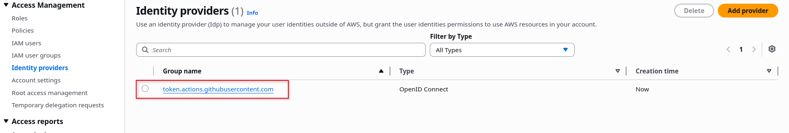

# How to configure aws OIDC with github action.

## Step 1 - Create Identity providers in aws
1. Go to IAM
2. Click on **Identity providers**
3. Click on **add provider**
4. In Provider type select **openID Connect**
5. For the provider URL: Use https://token.actions.githubusercontent.com
6. For the "Audience": Use **sts.amazonaws.com**
7. Confirm Identity providers is visible


## Step 2 - Create IAM role
1. Select **Web identity** under Trusted entity type.
2. Select **token.actions.githubusercontent.com** from Identity provider.
3. Select **sts.amazonaws.com** from Audience
4. On add permissionpage select policy **AmazonEC2ContainerRegistryFullAccess**
5. Enter role name and create the role.
6. Make sure you will see trust policy like below

```
{
	"Version": "2012-10-17",
	"Statement": [
		{
			"Effect": "Allow",
			"Principal": {
				"Federated": "arn:aws:iam::134448505602:oidc-provider/token.actions.githubusercontent.com"
			},
			"Action": "sts:AssumeRoleWithWebIdentity",
			"Condition": {
				"StringEquals": {
					"token.actions.githubusercontent.com:aud": "sts.amazonaws.com"
				},
				"StringLike": {
					"token.actions.githubusercontent.com:sub": "repo:maxpain62/hello-world:*"
				}
			}
		}
	]
}
```
```
{
    "Version": "2012-10-17",
    "Statement": [
        {
            "Effect": "Allow",
            "Principal": {
                "Federated": "arn:aws:iam::134448505602:oidc-provider/token.actions.githubusercontent.com"
            },
            "Action": "sts:AssumeRoleWithWebIdentity",
            "Condition": {
                "StringLike": {
                    "token.actions.githubusercontent.com:aud": "sts.amazonaws.com",
                    "token.actions.githubusercontent.com:sub": "repo:maxpain62/hello-world:*"
                }
            }
        }
    ]
}
```

## Step 3 - Verify with below code block
- note - make sure value of _**role-to-assume**_ must match role arn we created in *step 2*
```
    - name: Configure AWS Credentials 1
      id: creds
      uses: aws-actions/configure-aws-credentials@v6.1.0
      with:
        #uses the aws access key and secret access key from the github secrets
        audience: sts.amazonaws.com
        role-to-assume: arn:aws:iam::134448505602:role/hello-world-github-role
        aws-region: ap-south-1
        output-credentials: true

    - name: get caller identity 1
      run: aws sts get-caller-identity
```

## Below output will be displayed if authentication is successful 
```
Run aws-actions/configure-aws-credentials@v6.1.0
Assuming role with OIDC
Authenticated as assumedRoleId AROAR6TOBMMBMS6E5OVC5:GitHubActions
```