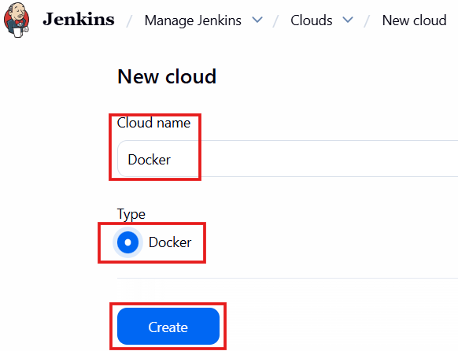
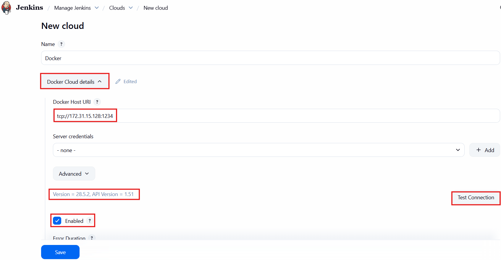
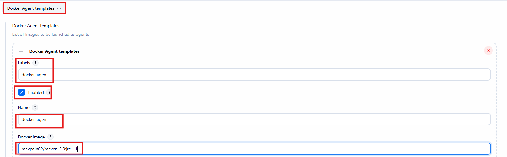
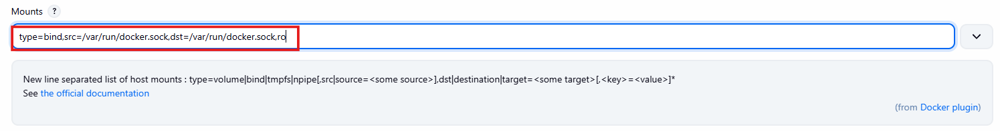
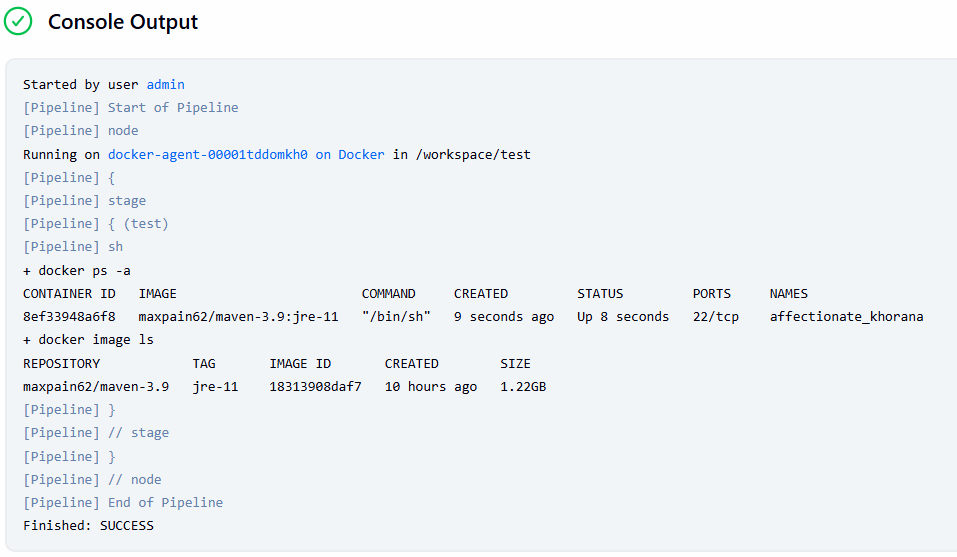

# Run docker inside docker container (Jenkins dynamic docker slave)

This is used when you have configured dynamic docker slave agent and want to build docker image inside docker container.

### Prequisits

- Jenkins installed on server
- Docker installed on remote server

### Step 1 - Configure remote access to docker daemon

1. Makesure docker is installed on docker server
2. If docker is not installed perform installation with below commands

```
sudo apt-get update
sudo apt-get install ca-certificates curl -y
sudo install -m 0755 -d /etc/apt/keyrings
sudo curl -fsSL https://download.docker.com/linux/ubuntu/gpg -o /etc/apt/keyrings/docker.asc
sudo chmod a+r /etc/apt/keyrings/docker.asc

# Add the repository to Apt sources:
echo "deb [arch=$(dpkg --print-architecture) signed-by=/etc/apt/keyrings/docker.asc] https://download.docker.com/linux/ubuntu $(. /etc/os-release && echo "${UBUNTU_CODENAME:-$VERSION_CODENAME}") stable" | sudo tee /etc/apt/sources.list.d/docker.list > /dev/null
sudo apt-get update

#install latest version of docker
sudo apt-get install docker-ce docker-ce-cli containerd.io docker-buildx-plugin docker-compose-plugin -y
```

3. After successful installation edit file _**/usr/lib/systemd/system/docker.service**_
4. Locate ExecStart in this file and change it to _**ExecStart=/usr/bin/dockerd -H fd:// -H tcp://0.0.0.0:1234 --containerd=/run/containerd/containerd.sock**_
   - **Note** - you can change port as per your preference, I have configured random port **1234**
5. After editind save file and run command systemctl _**daemon-reload**_ and _**systemctl restart docker**_

### Step 2 - Install _**Docker**_ plugin in jenkins

1. On jenkins home page click on Manage Jenkins  > Plugins > Available Plugins > Search for **Docker** > Click on install

### Step 3 - Configure docker agent

1. Click on Mamage Jenkins  >
   
2. Click on Docker Cloud Details below page will appear, enter details
   
   - Docker Host URI - Enter IP of docker server
   - After clicking on Test Connection version details should appear like **Version = 28.5.2, API Version = 1.51**
   - Click on Enabled
3. Configure Docker Agent Template
   
   - **Labels** will be used while running pipeline
   - Click on enabled
   - **Name** can be same as labels
   - Docker Image - Docker should be installed in docker image. If not then refer below **Dockerfile**
     - **Note** - After building docker image with below docker file image must be pushed to docker registery, else this configuration will not work.

```
FROM ubuntu:24.04

LABEL os="ubuntu:24.04"
LABEL java1="21"
LABEL java2="11"
LABEL maven="3.9"
LABEL contact="gauravbhatkar"

#Set environment variable
ENV m2_home=/opt/maven
ENV m2=/opt/maven/bin
ENV JAVA_HOME=/usr/lib/jvm/java-21-openjdk-amd64
ENV PATH=$m2_home:$m2:$JAVA_HOME/bin:$PATH

#download maven
ADD https://dlcdn.apache.org/maven/maven-3/3.9.11/binaries/apache-maven-3.9.11-bin.tar.gz /

#update and install jdk11, jdk21, openssh-server
RUN apt update && apt install openjdk-21-jre-headless openjdk-11-jre-headless openssh-server ca-certificates curl -y \
    #untar maven and move to opt
    && tar -zxf apache-maven-3.9.11-bin.tar.gz && mv apache-maven-3.9.11 /opt/maven \
    && rm apache-maven-3.9.11-bin.tar.gz && apt autoremove && apt clean \
    #adding jenkins user and change password
    && adduser --quiet jenkins && echo "jenkins:jenkins" | chpasswd \
    && mkdir /home/jenkins/.ssh/ /home/jenkins/.m2/ \
    #gpg key for docker
    && curl -fsSL https://download.docker.com/linux/ubuntu/gpg -o /etc/apt/keyrings/docker.asc

#Copy required files
#repository for docker
COPY docker.list /etc/apt/sources.list.d/
COPY id_ed25519.pub /home/jenkins/.ssh/authorized_keys
COPY toolschains.xml /home/jenkins/.m2/toolschains.xml

#Install docker
RUN apt update && apt install docker-ce docker-ce-cli containerd.io docker-buildx-plugin docker-compose-plugin -y \
    #change permission for jenkins home
    && chown -R jenkins:jenkins /home/jenkins/.ssh/ && chmod 600 /home/jenkins/.ssh/authorized_keys \
    && chmod 700 /home/jenkins/.ssh/

EXPOSE 22

#Start ssh server
CMD ["/usr/sbin/sshd", "-D"]
```

### Step 4 - Container setting

1. Container setting is part of Docker Agent Template only.
2. Here we have configure docker volume to run docker inside docker container.
3. Look for mounts and enter _**type=bind,src=/var/run/docker.sock,dst=/var/run/docker.sock,ro**_
   
4. When you use a bind mount, a file or directory on the host machine is mounted from the host into a container. By contrast, when you use a volume, a new directory is created within Docker's storage directory on the host machine, and Docker manages that directory's contents.
   - **Reference** - https://docs.docker.com/engine/storage/bind-mounts/

### Step 5 - Validate configuration by running sample pipeline.

1. Click on Create Job
2. Enter name
3. Click on pipeline from left menu
4. Enter below pipeline

```
pipeline {
    agent {
        label 'docker-agent'
    }
    stages {
        stage ('test') {
            steps {
                sh '''
                    docker ps -a
                    docker image ls
                   '''
            }
        }
    }
}
```

successful job will show result similer to this

