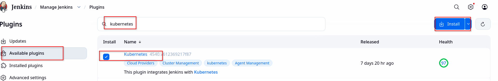
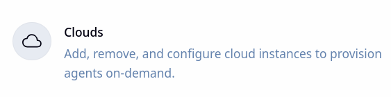
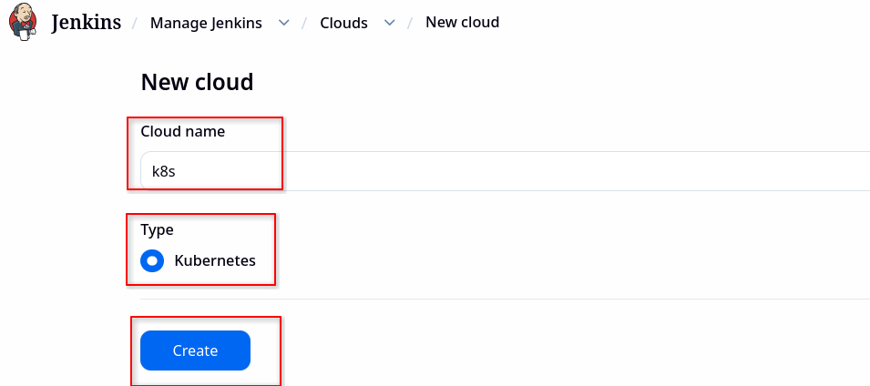
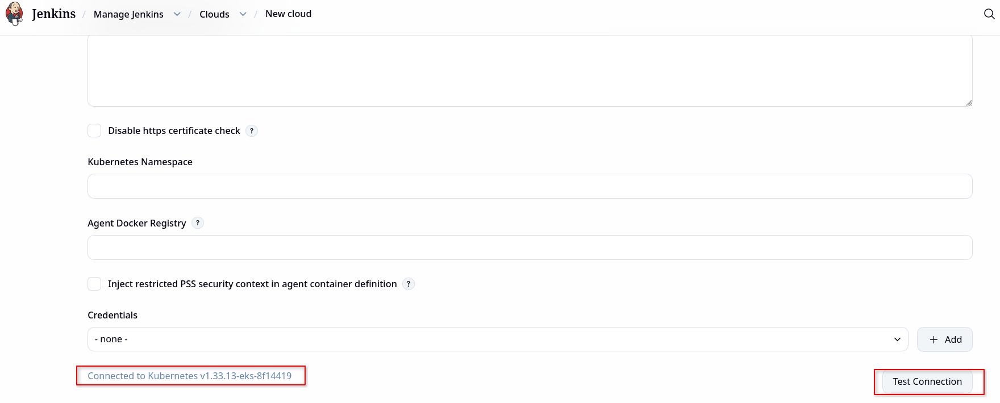

# Build docker image with buildkit in Jenkins running inside of Kubernetes

### Prerequisits -

1. Running kubeneted cluster

### Step 1 - Deploy Jenkins in k8s cluster

1. create namespace for jenkins
```
apiVersion: v1
kind: Namespace
metadata:
  name: devops-tools
```

2. Create RBAC with __*ClusterRole*__ and __*ClusterRoleBinding*__ for jenkins master
```
apiVersion: rbac.authorization.k8s.io/v1
kind: ClusterRole
metadata:
  name: jenkins
  namespace: devops-tools
rules:
  - apiGroups: ["*"]
    resources: ["*"]
    verbs: ["*"]
---
apiVersion: rbac.authorization.k8s.io/v1
kind: ClusterRoleBinding
metadata:
  name: jenkins
  namespace: devops-tools
subjects:
  - kind: ServiceAccount
    name: jenkins
    namespace: devops-tools
roleRef:
  apiGroup: rbac.authorization.k8s.io
  kind: ClusterRole
  name: jenkins
```

3. Create __*storage class*__ for jenkins deployment
```
apiVersion: storage.k8s.io/v1
kind: StorageClass
metadata:
  name: devops-tools-storage-class
provisioner: ebs.csi.aws.com
parameters:
  type: gp3
  csi.storage.k8s.io/fstype: ext4
  tagSpecification_1: "env=dev"
```

4. Create Jenkins Statefulset with below manifest
```
apiVersion: v1
kind: PersistentVolumeClaim
metadata:
  name: jenkins-pvc
  namespace: devops-tools
spec:
  storageClassName: devops-tools-storage-class
  accessModes: ["ReadWriteOnce"]
  resources:
    requests:
      storage: 5Gi
---
apiVersion: apps/v1
kind: StatefulSet
metadata:
  name: jenkins-ss
  namespace: devops-tools
  labels:
    app: jenkins
spec:
  replicas: 1
  selector:
    matchLabels:
      app: jenkins
  template:
    metadata:
      name: jenkins
      labels:
        app: jenkins
    spec:
      serviceAccountName: jenkins
      securityContext:
        # Note: fsGroup may be customized for a bit of better
        # filesystem security on the shared host
        fsGroup: 1000
        runAsUser: 1000
        ### runAsGroup: 1000
      containers:
        - name: jenkins
          image: jenkins/jenkins
          ports:
            - name: httpport
              containerPort: 8080
            - name: jnlpport
              containerPort: 50000
          livenessProbe:
            httpGet:
              path: "/login"
              port: 8080
            initialDelaySeconds: 30
            failureThreshold: 4
            periodSeconds: 20
          readinessProbe:
            httpGet:
              path: "/login"
              port: 8080
            initialDelaySeconds: 20
            failureThreshold: 4
            periodSeconds: 10
          volumeMounts:
            - name: jenkins
              mountPath: /var/jenkins_home
      volumes:
        - name: jenkins
          persistentVolumeClaim:
            claimName: jenkins-pvc
---
apiVersion: v1
kind: Service
metadata:
  name: jenkins
  namespace: devops-tools
spec:
  type: NodePort
  selector:
    app: jenkins
  ports:
    - name: httpport
      port: 8080
      targetPort: 8080
      nodePort: 30001
    - name: jnlpport
      port: 50000
      targetPort: 50000

```

### Step 2 - Creating buildkit-daemon and kubernetes secret

1. Create secret for storing aws ecr password token

- create env variable DOCKER_USER, DOCKER_PASS

```
export DOCKER_USER=AWS
export DOCKER_PASS=$(aws ecr get-login-password --region ap-south-1)
```  

- create secret with below commands, this secret will be used by jenkins slave to upload docker image to aws ecr
```
kubectl  --namespace devops-tools create secret docker-registry ecr-cred\
 --docker-server="https://134448505602.dkr.ecr.ap-south-1.amazonaws.com"\
 --docker-username="${DOCKER_USER}" --docker-password="${DOCKER_PASS}"\
 --dry-run=client -o yaml > ecr-cred.yaml

 kubectl apply -f ecr-cred.yaml
```

2. Create buildkit-daemon 

- refer file for generating certificates k8s/00_expirements/devops-tools/01-jenkins/create-certs.sh
```
#!/bin/bash
#execute below file like "bash create-certs.sh buildkitd.devops-tools.svc.cluster.local"
set -o errexit
set -o nounset
set -o pipefail
set -o errtrace

PRODUCT=buildkit
DIR=./certs
if [[ "$#" -lt 1 ]]; then
        echo "Usage: $0 SAN [SAN...]"
        echo
        echo "Example: $0 buildkitd.default.svc 127.0.0.1"
        echo
        echo "The following files will be created under ${DIR}"
        echo "- daemon/{ca.pem,cert.pem,key.pem}"
        echo "- client/{ca.pem,cert.pem,key.pem}"
        echo "- ${PRODUCT}-daemon-certs.yaml"
        echo "- ${PRODUCT}-client-certs.yaml"
        echo "- SAN"
        exit 1
fi
if ! command -v mkcert >/dev/null; then
        echo "Missing mkcert (https://github.com/FiloSottile/mkcert)"
        exit 1
fi
SAN=$@
SAN_CLIENT=client

mkdir -p $DIR ${DIR}/daemon ${DIR}/client
(
        cd $DIR
        echo $SAN | tr " " "\n" >SAN
        CAROOT=$(pwd) mkcert -cert-file daemon/cert.pem -key-file daemon/key.pem ${SAN} >/dev/null 2>&1
        CAROOT=$(pwd) mkcert -client -cert-file client/cert.pem -key-file client/key.pem ${SAN_CLIENT} >/dev/null 2>&1
        cp -f rootCA.pem daemon/ca.pem
        cp -f rootCA.pem client/ca.pem
        rm -f rootCA.pem rootCA-key.pem

        kubectl create secret --namespace devops-tools generic ${PRODUCT}-daemon-certs --dry-run=client -o yaml --from-file=./daemon >${PRODUCT}-daemon-certs.yaml
        kubectl create secret --namespace devops-tools generic ${PRODUCT}-client-certs --dry-run=client -o yaml --from-file=./client >${PRODUCT}-client-certs.yaml
)
```

- run command to create certificates for buildkit
```
bash create-certs.sh buildkitd.devops-tools.svc.cluster.local
```

- Once this command is executed successfully __*certs*__ directory will be created in current directory.
__*certs*__ directory should contain 2 files which are generated by __*create-certs.sh*__ script
    - buildkit-daemon-certs.yaml
    - buildkit-client-certs.yaml
- Create secret with these 2 files. These secret contains certificates required by buildkit-daemon and client. It will be mounted as volume in buildkit-daemon and client
```
kubectl apply -f certs/buildkit-daemon-certs.yaml
kubectl apply -f certs/buildkit-client-certs.yaml
```

- create deployment for buildkit-daemon
```
apiVersion: apps/v1
kind: Deployment
metadata:
  labels:
    app: buildkitd
  name: buildkitd
  namespace: devops-tools
spec:
  replicas: 1
  selector:
    matchLabels:
      app: buildkitd
  template:
    metadata:
      labels:
        app: buildkitd
    spec:
      containers:
        - name: buildkitd
          image: moby/buildkit:v0.15.0
          args:
            - --addr
            - unix:///run/buildkit/buildkitd.sock
            - --addr
            - tcp://0.0.0.0:1234
            - --tlscacert
            - /certs/ca.pem
            - --tlscert
            - /certs/cert.pem
            - --tlskey
            - /certs/key.pem
          # the probe below will only work after Release v0.6.3
          readinessProbe:
            exec:
              command:
                - buildctl
                - debug
                - workers
            initialDelaySeconds: 5
            periodSeconds: 30
          # the probe below will only work after Release v0.6.3
          livenessProbe:
            exec:
              command:
                - buildctl
                - debug
                - workers
            initialDelaySeconds: 5
            periodSeconds: 30
          securityContext:
            privileged: true
          ports:
            - containerPort: 1234
          volumeMounts:
            - name: certs
              readOnly: true
              mountPath: /certs
      volumes:
        # buildkit-daemon-certs must contain ca.pem, cert.pem, and key.pem
        - name: certs
          secret:
            secretName: buildkit-daemon-certs
---
apiVersion: v1
kind: Service
metadata:
  labels:
    app: buildkitd
  name: buildkitd
  namespace: devops-tools
spec:
  ports:
    - port: 1234
      protocol: TCP
  selector:
    app: buildkitd
```

- Once this step is done make sure that jenkins and buildkitd pod is running
```
NAME                             READY   STATUS    RESTARTS   AGE
pod/buildkitd-8568d4f858-xf47h   1/1     Running   0          62s
pod/jenkins-ss-0                 1/1     Running   0          9m1s
```

### Step 3 - Configure Jenkins master to use containerize jenkis slave.

1. Install kubernetes plugin
- Click on manager jenkins 
- Click on plugins 
- Search kubernetes plugin and install 

2. Once kubernetes plugin is installed configure kubernetes cloud.
- Click on manager jenkins 
- Click on Clouds 
- Click on new cloud
- Enter name of your choice and click on create 
- Click on test connection in new cloud page , Connected to Kubernetes should appear after clicking.
- Enter jenkins url "http://jenkins:8080" and click on save