# Jenkins docker slave configuration

### Step 1 - Instance creation

- create 2 instances / vm and install.
- On instance 1 install jenkins and on instance 2 install docker.
- refer below scripts install jenkins and docker

#### 1.1 Jenkins installation bash script

```
#!/bin/bash
sudo apt update
sudo apt install fontconfig openjdk-21-jre-headless -y


sudo wget -O /etc/apt/keyrings/jenkins-keyring.asc https://pkg.jenkins.io/debian-stable/jenkins.io-2023.key
echo "deb [signed-by=/etc/apt/keyrings/jenkins-keyring.asc]" https://pkg.jenkins.io/debian-stable binary/ | sudo tee /etc/apt/sources.list.d/jenkins.list > /dev/null
sudo apt update
sudo apt install jenkins -y
```

#### 1.2 docker installation bash script

```
#!/bin/bash
# Add Docker's official GPG key:
sudo apt-get update
sudo apt-get install ca-certificates curl -y
sudo install -m 0755 -d /etc/apt/keyrings
sudo curl -fsSL https://download.docker.com/linux/ubuntu/gpg -o /etc/apt/keyrings/docker.asc
sudo chmod a+r /etc/apt/keyrings/docker.asc

# Add the repository to Apt sources:
echo "deb [arch=$(dpkg --print-architecture) signed-by=/etc/apt/keyrings/docker.asc] https://download.docker.com/linux/ubuntu $(. /etc/os-release && echo "${UBUNTU_CODENAME:-$VERSION_CODENAME}") stable" | sudo tee /etc/apt/sources.list.d/docker.list > /dev/null
sudo apt-get update

#install latest version of docker
sudo apt-get install docker-ce docker-ce-cli containerd.io docker-buildx-plugin docker-compose-plugin -y
```

### Stpe 2 - configure docker to accept traffic from remote machine

- Edit file - _**/usr/lib/systemd/system/docker.service**_
- locate line starting with _**ExecStart**_
- Replace with _**ExecStart=/usr/bin/dockerd -H tcp://0.0.0.0:4243 -H unix:///var/run/docker.sock**_
- Save the configuration and run command _**systemctl daemon-reload**_
- Restart docker service _**systemctl restart docker.service**_
- make sure docker is accepting traffic on port 4243, you can change this port number as per your reqirement.
- Verify docker is listening on port with _**netstat -tunlpa**_ command, you will get result similer to below output :-

```
  tcp6 0 0 :::4243 :::\* LISTEN 2881/dockerd
```

### Step 3 - Login to docker instance for docker image creation

- Create docker image with below _**Dockerfile**_

```
FROM ubuntu:24.04
RUN apt update && apt install openjdk-21-jre-headless wget tar git openssh-server -y && mkdir /var/run/sshd\
    && wget https://dlcdn.apache.org/maven/maven-3/3.9.11/binaries/apache-maven-3.9.11-bin.tar.gz -O /opt/apache-maven-3.9.11-bin.tar.gz \
    && tar -zxf /opt/apache-maven-3.9.11-bin.tar.gz -C /opt/ && rm -rf /opt/apache-maven-3.9.11-bin.tar.gz\
    && apt autoremove && apt clean && adduser --quiet jenkins && echo "jenkins:jenkins" | chpasswd && mkdir /home/jenkins/.m2
COPY ./authorized_keys /home/jenkins/.ssh/authorized_keys
RUN chown -R jenkins:jenkins /home/jenkins/.m2/ && chown -R jenkins:jenkins /home/jenkins/.ssh/
EXPOSE 22
CMD ["/usr/sbin/sshd", "-D"]
```

- Build docker image _**docker build -t maxpain62/ubuntu-24.04:jdk-21 .**_
- You can tag docker image as per your requirement
- Once docker image is created push it to docker hub docker _**image push maxpain62/ubuntu-24.04:jdk-21**_

### Step 4 - Install docker pluggin in jenkins instance

### Step 5 - Configure credentials

- Add ssh credeatials click on _**Manage Jenkins**_ > _**Credentials**_
  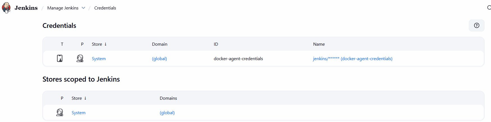
- Click on _**System**_ > _**Global credentials (unrestricted)**_ > _**Add credentials**_. Below page will apprear
  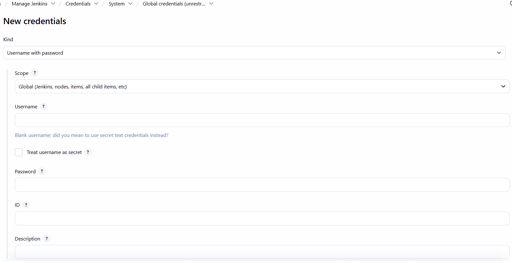
- Select kind username with password. Enter username and password of your choice here I have entered username as _**jenkins**_ and password as well _**jenkins**_, as I have mentioned same in Dockerfile configuration in _**Step 3**_
- Click on save

### Step 6 - Configure jenkins slave

- Click on _**Manage Jenkins > Clouds > New Cloud**_.
  Below page will display

  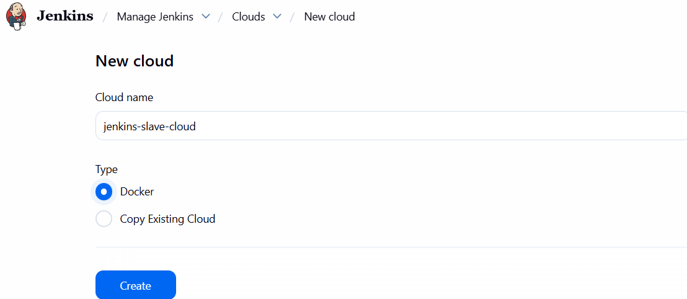

- Enter cloud name and select Docker and click on Create
- On next page enter docker cloud details like below  
  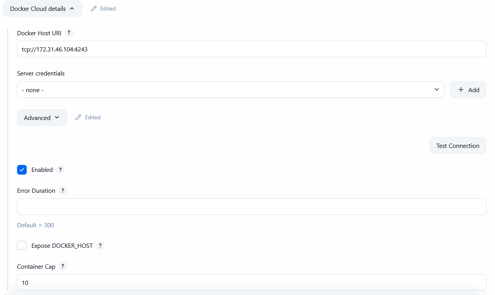
- Click test connection to check connectivity with docker host. Successful connection will show output like below.
  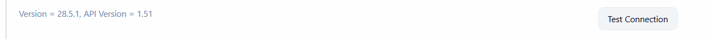
- Scroll down and click on Docker agent tenplate
  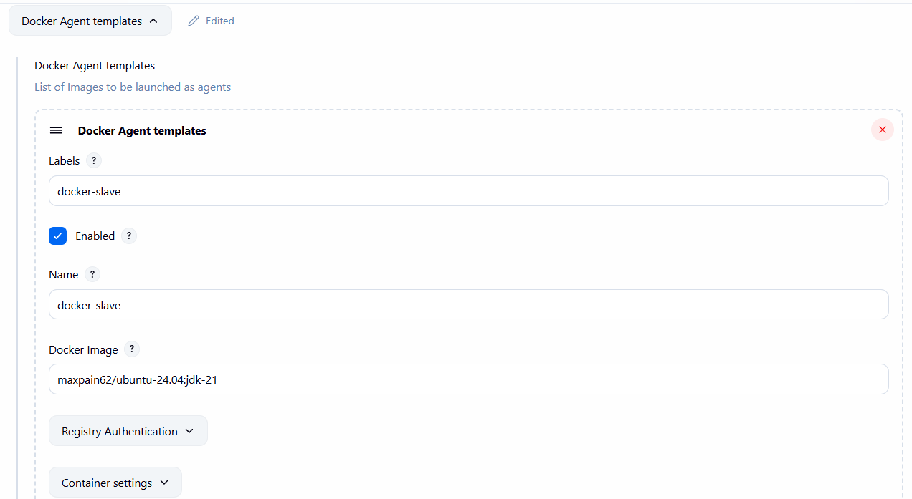
- Enter Details as per given screenshot, Label and name can be same to avoide confusion.
- We will require label details while configurng pipeline.
- Enter name of docker image which we created in _**Step 3**_
- Enter remote file system root and connection method as per screenshot
  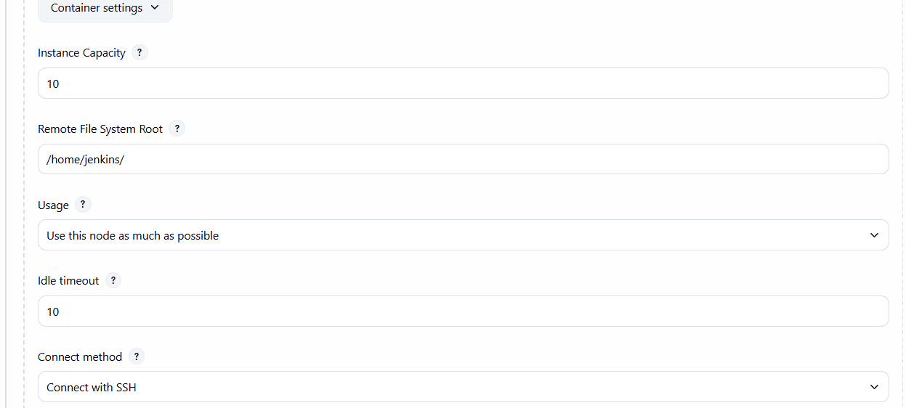
- Configure Connect method as below. Select SSh credentials we have created in _**Step 5**_
  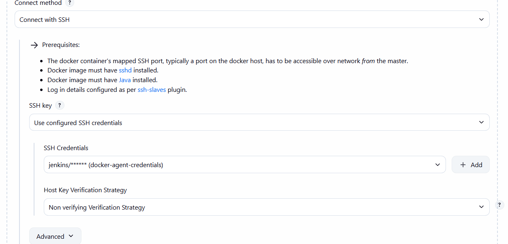
- Click on save

### Step 7 - Run sample pipeline

- Create a freestyle job
  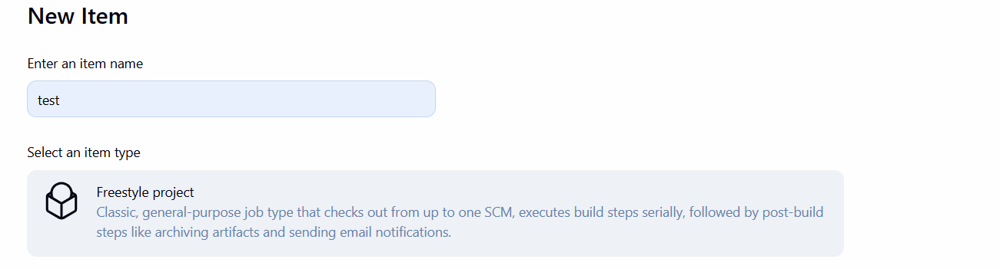
- Check Restrict where this project can be run check box and enter _**Docker agent template**_ name we created in Step 6
  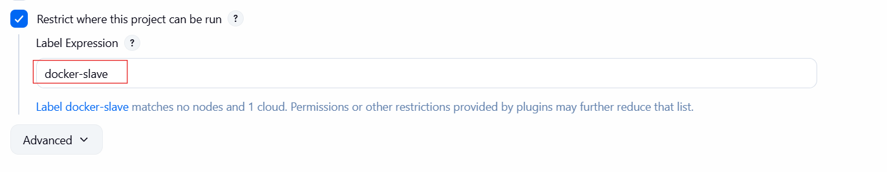
- Scroll down till build steps and select execute shell
  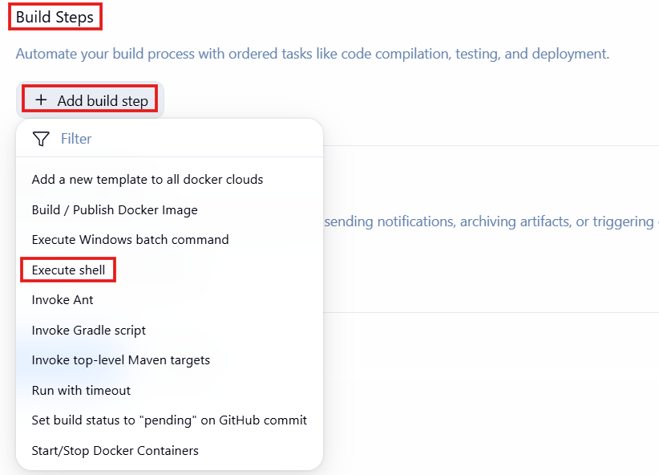
  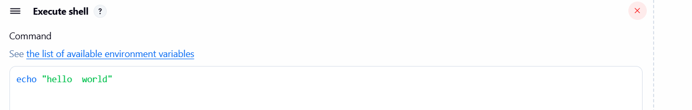
- Save the configuration and click on Build Now
  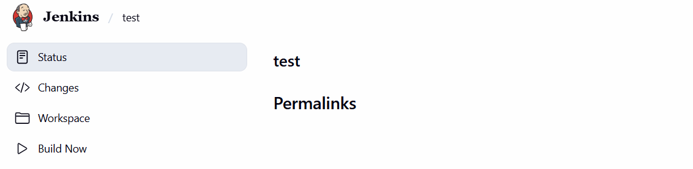
- Console output will be similer to below image
  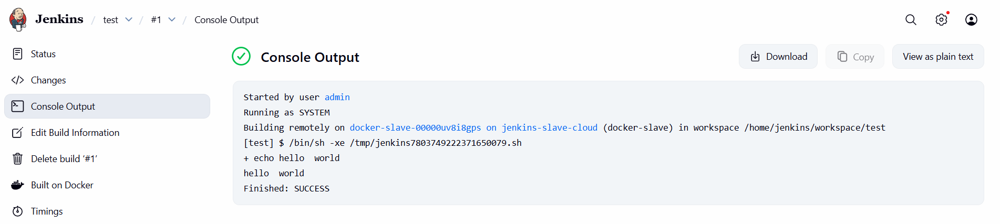
